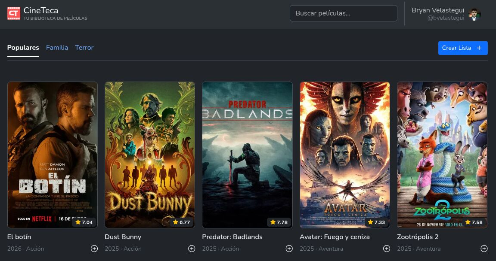
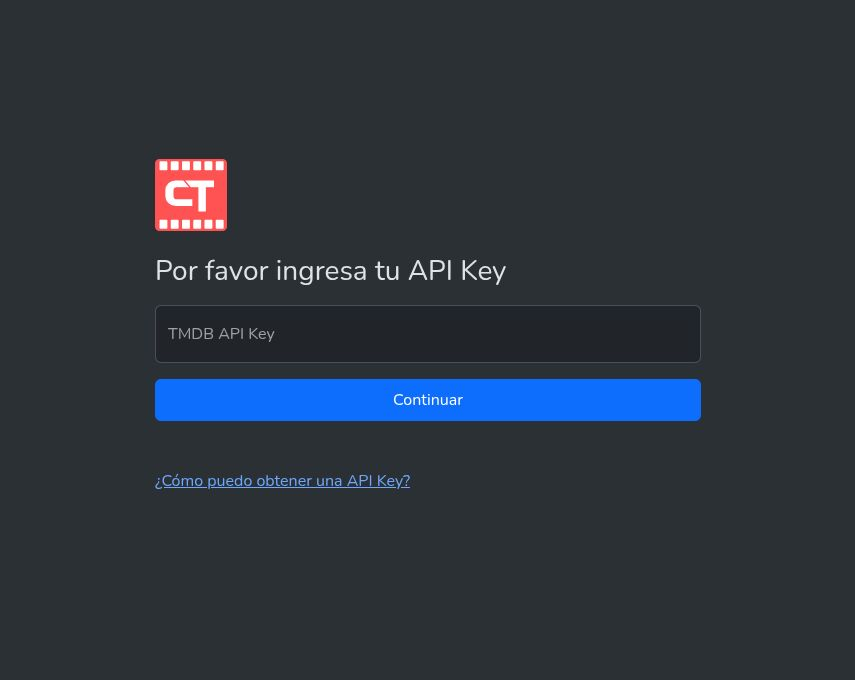
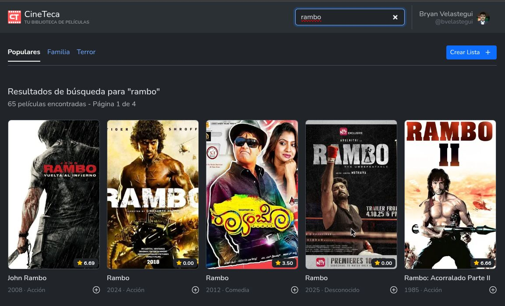
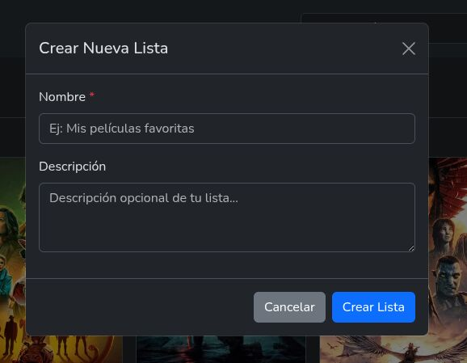
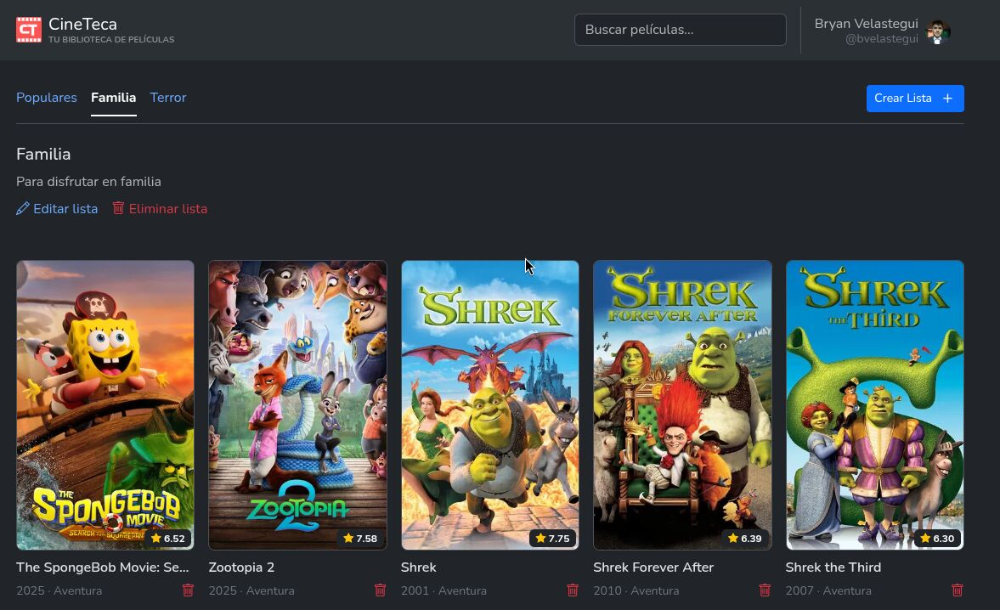
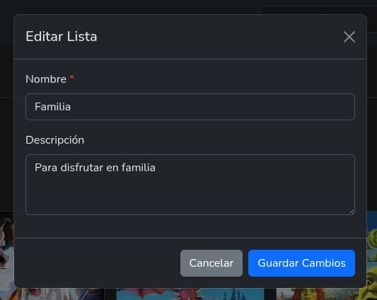
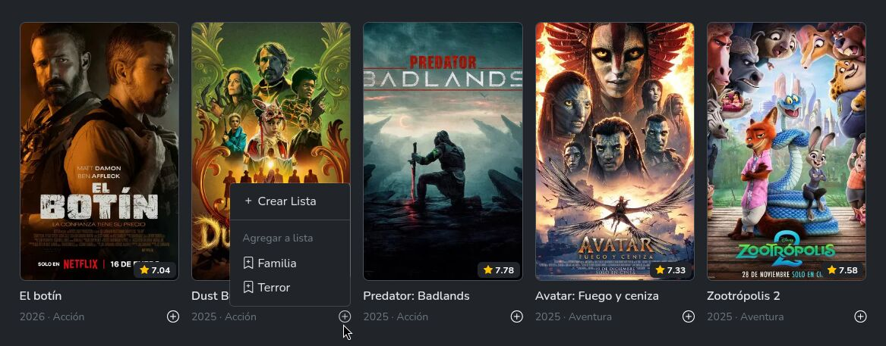

<div align="center">
  
  
  # CineTeca
  
  ### Tu Biblioteca Personal de Películas
  
  **Descubre, organiza y gestiona tus películas favoritas con CineTeca.**  
  Conecta con la API de TMDB y crea listas personalizadas de tus películas preferidas.
  
  [](https://developer.mozilla.org/es/docs/Web/JavaScript)
  [](https://getbootstrap.com/)
  [](https://www.themoviedb.org/)
  [](LICENSE)
  
  [Ver Demo](#) • [Reportar Bug](https://github.com/bvelastegui/cineteca/issues) • [Solicitar Característica](https://github.com/bvelastegui/cineteca/issues)
  
</div>

## Capturas de Pantalla

<div align="center">
  
  <p><em>Dashboard principal con películas populares</em></p>
</div>

<table>
  <tr>
    <td width="50%">
      
      <p align="center"><strong>Inicio de Sesión</strong><br>Autenticación OAuth con TMDB</p>
    </td>
    <td width="50%">
      
      <p align="center"><strong>Búsqueda Avanzada</strong><br>Encuentra películas al instante</p>
    </td>
  </tr>
  <tr>
    <td>
      
      <p align="center"><strong>Crear Listas</strong><br>Listas personalizadas</p>
    </td>
    <td>
      
      <p align="center"><strong>Gestión de Listas</strong><br>Administra tus colecciones</p>
    </td>
  </tr>
  <tr>
    <td>
      
      <p align="center"><strong>Editar Listas</strong><br>Modifica fácilmente</p>
    </td>
    <td>
      
      <p align="center"><strong>Agregar Películas</strong><br>Añade a tus listas</p>
    </td>
  </tr>
</table>

## Características Principales

<table>
  <tr>
    <td width="33%" align="center">
      <h3>Búsqueda Avanzada</h3>
      <p>Busca películas en tiempo real utilizando la API de TMDB. Encuentra cualquier película con búsqueda instantánea y resultados paginados.</p>
    </td>
    <td width="33%" align="center">
      <h3>Listas Personalizadas</h3>
      <p>Crea y gestiona listas personalizadas de películas. Organiza tus favoritas, películas por ver, o cualquier categoría que imagines.</p>
    </td>
    <td width="33%" align="center">
      <h3>Autenticación OAuth</h3>
      <p>Inicia sesión de forma segura con tu cuenta de TMDB. Tus datos están protegidos con autenticación OAuth 2.0.</p>
    </td>
  </tr>
  <tr>
    <td align="center">
      <h3>Caché Inteligente</h3>
      <p>Sistema de caché con TTL de 1 hora que optimiza las peticiones y mejora la velocidad de carga de la aplicación.</p>
    </td>
    <td align="center">
      <h3>Películas Populares</h3>
      <p>Descubre las películas más populares del momento. Explora tendencias y encuentra tu próxima película favorita.</p>
    </td>
    <td align="center">
      <h3>Gestión Completa</h3>
      <p>CRUD completo de listas: crea, edita, elimina y organiza. Agrega o quita películas de tus listas con un solo clic.</p>
    </td>
  </tr>
</table>

## Inicio Rápido

### Requisitos Previos

- Navegador web moderno (Chrome, Firefox, Safari, Edge)
- API Key de TMDB (gratuita)
- Servidor HTTP local para desarrollo

### Obtener API Key de TMDB

1. Crear cuenta en [The Movie Database](https://www.themoviedb.org/)
2. Ir a **Configuración → API**
3. Solicitar API Key (seleccionar "Developer")
4. Copiar la API Key generada

### Ejecutar Localmente

```bash
# Clonar el repositorio
git clone https://github.com/bvelastegui/cineteca.git
cd cineteca

# Opción 1: Python 3 (recomendado)
python3 -m http.server 8000

# Opción 2: Node.js
npx http-server -p 8000

# Opción 3: PHP
php -S localhost:8000

# Abrir en el navegador
# http://localhost:8000
```

> **Nota:** Usa un servidor HTTP local en lugar de abrir `index.html` directamente para evitar problemas con CORS y módulos ES6.

## Tecnologías Utilizadas

<div align="center">

| Frontend | API & Storage | Deployment |
|:--------:|:-------------:|:----------:|
|  |  |  |
|  |  | |
|  | | |
|  | | |

</div>

### Características Técnicas

- **Vanilla JavaScript**: Aplicación sin frameworks, usando JavaScript puro con ES6+ Modules, async/await
- **Arquitectura Modular**: Código organizado siguiendo el patrón ETL (Extract-Transform-Load)
- **Sin Dependencias**: No requiere npm, webpack, o bundlers
- **Responsive Design**: Compatible con móviles, tablets y desktop

## Estructura del Proyecto

```
cineteca/
├── assets/
│   └── img/
│       ├── logo.svg
│       └── landing/          # Screenshots de la app
├── js/
│   ├── core/                 # Núcleo de la aplicación
│   │   ├── auth.js          # Sistema de autenticación OAuth
│   │   ├── cache.js         # Sistema de caché con TTL
│   │   └── dom.js           # Utilidades DOM
│   ├── peliculas/           # Módulo de películas
│   │   ├── api.js           # API de TMDB
│   │   ├── normalizador.js  # Adaptador ETL
│   │   └── renderizador.js  # Renderizado de UI
│   ├── listas/              # Módulo de listas
│   │   ├── api.js
│   │   ├── normalizador.js
│   │   └── renderizador.js
│   └── config/
│       └── constantes.js    # Constantes globales
├── index.html               # Landing page
├── login.html               # Página de autenticación
├── home.html                # Dashboard principal
└── README.md
```

### Patrón de Arquitectura

El proyecto implementa el patrón **ETL (Extract-Transform-Load)**:

1. **Extract**: Los datos se obtienen de la API de TMDB
2. **Transform**: Los adaptadores/normalizadores convierten los datos (inglés → español)
3. **Load**: Los datos transformados se cargan en la UI y localStorage

## Funcionalidades

### Sistema de Autenticación OAuth
- Flujo OAuth completo con TMDB
- Persistencia de sesión (localStorage/sessionStorage)
- Gestión segura de cierre de sesión
- Validación de sesión activa

### Dashboard de Películas
- Visualización de películas populares
- Sistema de paginación
- Loading spinners y estados de carga
- Sistema de tabs (Populares / Listas)

### Búsqueda y Filtros
- Búsqueda en tiempo real con debounce
- Paginación de resultados
- Filtrado por género
- Detección de películas duplicadas

### CRUD de Listas
- Crear listas personalizadas
- Ver todas las listas del usuario
- Editar listas (nombre y descripción)
- Eliminar listas completas
- Agregar/eliminar películas de listas
- Modals de confirmación

### Experiencia de Usuario
- Bootstrap Toasts para notificaciones
- Placeholders para imágenes
- Sistema de caché inteligente (TTL 1h)
- Landing page con galería de screenshots

## Futuras Mejoras

- Filtros avanzados por fecha de estreno
- Búsqueda por actor y director
- Ordenamiento personalizado de resultados
- Sistema de favoritos y watchlist
- Modo oscuro/claro
- Compartir listas con otros usuarios

## Arquitectura Técnica

### Sistema de Caché Inteligente

```javascript
// TTL de 1 hora por defecto
// Namespacing automático
// Limpieza automática de datos expirados
// Manejo de QuotaExceededError

const cache = new CacheService('movies_');
cache.set('popular', data, 60); // 60 minutos TTL
const cached = cache.get('popular');
```

### Arquitectura Modular

```
┌─────────────────────────────────────────┐
│          Capa de Presentación           │
│        (HTML + Renderizadores)          │
└─────────────────────────────────────────┘
                    ↓
┌─────────────────────────────────────────┐
│        Capa de Normalizadores           │
│        (Patrón ETL - Transform)         │
└─────────────────────────────────────────┘
                    ↓
┌─────────────────────────────────────────┐
│            Capa de API                  │
│    (Comunicación con TMDB - Extract)    │
└─────────────────────────────────────────┘
                    ↓
┌─────────────────────────────────────────┐
│          Capa de Caché/Storage          │
│      (localStorage - Load/Persist)      │
└─────────────────────────────────────────┘
```

## Documentación Adicional

- **[OBJETIVO.md](OBJETIVO.md)**: Objetivos detallados y división de tareas
- **[INSTRUCTIONS.md](INSTRUCTIONS.md)**: Instrucciones de la asignatura

## Equipo de Desarrollo

<table>
  <tr>
    <td align="center">
      <a href="https://github.com/bvelastegui">
        <br />
        <sub><b>Bryan Velastegui</b></sub>
      </a><br />
      <a href="https://github.com/bvelastegui" title="GitHub">@bvelastegui</a>
    </td>
    <td align="center">
      <a href="https://github.com/evelyn18m">
        <br />
        <sub><b>Evelyn Morocho</b></sub>
      </a><br />
      <a href="https://github.com/evelyn18m" title="GitHub">@evelyn18m</a>
    </td>
  </tr>
</table>

## Licencia

Este proyecto está licenciado bajo la **MIT License** - ver [LICENSE](LICENSE) para más detalles.

### Uso Académico

Este proyecto fue desarrollado como parte de un proyecto final de la asignatura de **Desarrollo de Software** con fines educativos.

### Atribuciones

- Información de películas proporcionada por [The Movie Database (TMDB) API](https://www.themoviedb.org/)
- TMDB API está sujeta a sus propios [términos de servicio](https://www.themoviedb.org/terms-of-use)
- Este proyecto no está respaldado ni certificado por TMDB

## Enlaces Útiles

- [TMDB API Documentation](https://developers.themoviedb.org/3)
- [Bootstrap 5 Documentation](https://getbootstrap.com/docs/5.3/)
- [MDN Web Docs - JavaScript](https://developer.mozilla.org/es/docs/Web/JavaScript)
- [GitHub Pages Documentation](https://docs.github.com/es/pages)

<div align="center">
  
  **Instituto Tecnológico Superior CENESTUR** • 2026
  
  Hecho con ❤️ usando Vanilla JavaScript
  
</div>
